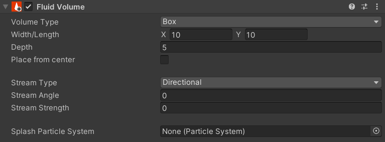

# Fluid Volume 

The Fluid Volume component defines an area filled with a user-defined "fluid". Combined with the [Physics Influencer](physics-influencer.md) this controls buoyancy for objects, as well as triggering swimming animations on the player [avatar](cvr-avatar.md).

## UI

__Volume Type__

This dropdown allows you to select between the two supported zone shapes:

- Box
  
  or
  
-  Sphere

__Width/Length__

Defines the distance between the faces of the fluid zone along the __LOCAL__ X (X) and Z (Y) axes. At default scale, this is 10 meters by default.

__Depth__

Defines the "depth" of the fluid zone along the __LOCAL__ Y axis. At default scale, this is 5 meters by default.

__Place From Center__

Determines whether depth should be managed from the center of the volume, or from the center of the top face.
  
__Stream Type__

Stream in this context refers to to a flowing force within the Fluid volume, such as a flowing river or water cannon. The Stream Direction dropdown contains two states:
- Directional: The entire volume flows in a single direction defined by the Stream Angle.
- Outward: Flows outward omnidirectionally from the origin.

__Stream Angle__

The angle the stream flows toward in degrees. 0 is local +Z.

__Stream Strength__

This applies a force in the direction of the stream. Strength is measured in newtons multiplied by the submerged volume of an affected object.

__Splash Particle System__

The [Particle System](https://docs.unity3d.com/2021.3/Documentation/Manual/class-ParticleSystem.html) you wish to activate when an object enters or exits the volume.

## Examples

There are currently no examples. If you'd like to add one, please contribute! Community contributions can be submitted to our [Documentation Github](https://github.com/ChilloutVR-Team/docs).