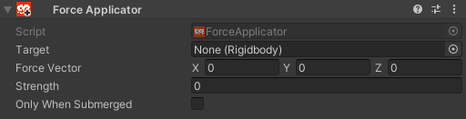

# Force Applicator 

The Force Applicator is a relatively simple component that applies a force along a local vector while active.

## UI

__Target__

The Rigidbody the force applies to

__Force Vector__

the vector from which the force is applied, with separate fields for the (local) X, Y, and Z axes.

__Strength__

Force applied in newton-meters.

__Only While Submerged__

While active, only allows the applicator to produce a force while the GameObeject its attached to is submerged.

## Examples

There are currently no examples. If you'd like to add one, please contribute! Community contributions can be submitted to our [Documentation Github](https://github.com/ChilloutVR-Team/docs).