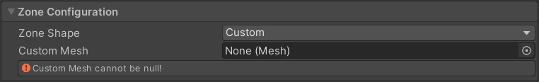

# Gravity Zone 

The Gravity Zone component introduces gravitational physics to any GameObject in a world or on a prop. Gravity zones can be inward, outward, neutralize each other and interact in unique ways for novel gameplay, mechanics, gimmicks, and more. Additionally, Gravity Zones can fit a wide variety of shapes and applications, making them highly versatile tools in content creation.
## UI

### Zone configuration

The Zone configuration section includes basic settings for the size, orientation, and shape of the Gravity Zone. It has the following settings:

__Zone Shape -__

A dropdown that defines the shape of the gravity zone. it has the following oprions:

- Box

	

- Sphere
	

- Capsule (Cylinder has the same settings)

	

- Cylinder

- Half Sphere

- Quarter Sphere

- Half Capsule

- Quarter Capsule

- Half Cylinder

- Quarter Cylinder

- Custom

	

Note that only the Custom shape does not have a center field. Additionally, the settings for the half and quarter variants are identical to their full versions.

__Center -__

Displacement from the root position on the X, Y, and Z axes.

__Size (Box) -__

The the distance between faces along the X, Y, and Z axes. Note that this is the distance between faces and not distance from center.

__Gravity Direction (Box) -__

This dropdown selects the axis that gravity "flows" along. "Toward Center" flows inward to the shape's center evenly. At default scale, this is measured in meters. Contains the following options:

- Direction X
- Direction Y
- Direction Z
- Toward Center

__Radius (Sphere, Capsule, Cylinder) -__

The distance from center to edge for the spherical or circular component of the shape. At default scale, this measurement is in meters.

__Height (Capsule, Cylinder) -__

The distance between extreme ends of the shape. In Capsules, this is from tip to tip, in cylinders it's from face to face. Note that the orientation for this measurement is the same for half and quarter shapes as well. At default scale, this is measured in meters.

### General Configuration

The General Configuration section defines specifics about the gravity zone such as its intensity and how it interacts with players and objects.

__Mix__

This dropdown controls the way this Gravity Zone interacts with other Gravity Zones. Contains 2 options:

- Override (default) - Completely overrides zones of lower priority

- Additive - combines the gravitational influence of this zone with any other zones that do not override it.

__Priority__

Determines which Gravity Zones take priority when multiple absolute zones overlap. Higher values have higher priority, default is 0.

__Strict Collision__

Uses a smaller collision box for influence detection. Generally useful for larger transitions between surfaces (e.g.: using a quarter cylinder on a rounded floor and wall transition).

Not ideal for the majority of uses due to the collision shape used being significantly smaller than a player. Leave this disabled unless influence is being applied when it shouldn't

__Type__

This dropdown determines which method of calculation is used for defining the acceleration force of the zone. It has two options:

- Absolute (Default): Uses the strength value directly in meters per second squared.

- Relative: Sets strength as a multiplier of the world or overlapping zones' gravity.

!!! info
    When using Relative Type, Strength is a multiple of the gravity setting in the [CVR World](cvr-world.md) component, or any overlapping Gravity Zones. This can result in very high or very low values so use with caution on props.

__Strength__

The acceleration force the Gravity Zone applies to any affected objects. Negative values invert the flow direction, which can be used for reversing axes or making repulsive forces.

__Effected Objects__

Checklist of objects affected by the Gravity Zone. contains the following options:

- Nothing
- Everything (automatically includes objects and players)
- Objects (props and world physics items)
- Players

__Player Gravity Alignment Mode__

This dropdown selects the method by which the Gravity Zone reorients the player when they enter it, unless set to disabled. it contains 4 settings:

- Auto: Aligns the player to the direction of gravity at a speed relative to the field's strength. This is the default setting, and is highly recommended unless you have a specific reason not to use it.
- Disabled: Completely disables player rotation to reorient into the flow of gravity.
- Instantly: Snaps the player into the direction of gravity immediately upon receiving influence. 
- Custom:

	- Rotation Speed (Degrees/second): As the label implies, the rotation speed in degrees per second for the custom alignment mode.

!!! tip
    To prevent motion sickness, the automatic alignment mode can be overridden by player settings. However, only automatic can be overridden. Because of this, please be considerate of other options as these may produce undesirable or unplayable results.

### Editor Gizmos

This section contains options for the editor-only visualizations.

__Draw Gismos__

Toggles the visualization on or off completely.

__Gravity Visual Animation__

Toggles the gravity "flow" visualization, but leaves the border of the zone visible.

__Opacity__

The overall opacity of the visualizer, ranging from 0 (invisible) to 1 (completely solid). Default is 0.5.

## Examples

There are currently no examples. If you'd like to add one, please contribute! Community contributions can be submitted to our [Documentation Github](https://github.com/ChilloutVR-Team/docs).