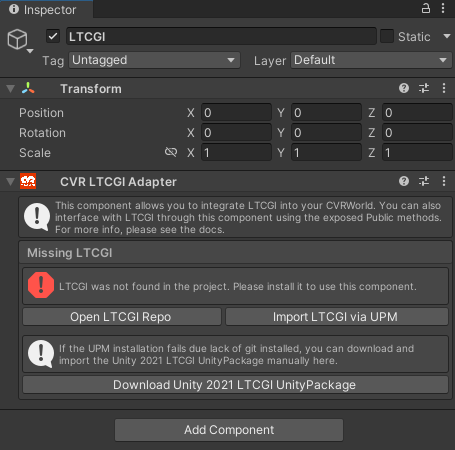
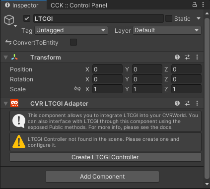
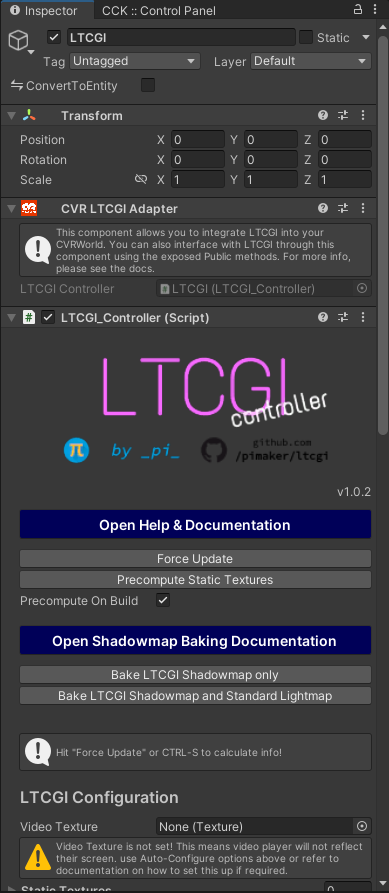
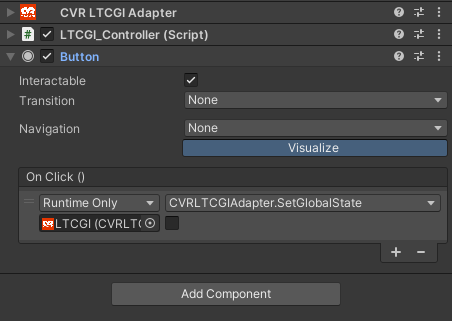

# CVR LTCGI Adapter 

This component provides the interface to set up and control [LTCGI](<https://ltcgi.dev/>) in your World

### Setup

The component will guide you to set up LTCGI

1. Pick any game object and select `Add Component` and look for `CVR LTCGI Adapter` in `Chillout VR`. You should get
   something like this: 
2. You can now click `Import LTCGI via UPM`, this will download and install the LTCGI package in your unity project. 
   Note: If you already have it in your project you may skip this step
3. If LTCGI is installed in you project you should see something like
   this: 
4. Now click on `Create LTCGI Controller`, so it adds the LTCGI Controller component to the game object
5. The end result should be something like
   this: 
6. You can now configure the LTCGI Controller (for example adding the Video Player Texture) and other settings you may
   want to change. After that you should be all set.

### Controlling during Runtime

There are 2 methods you can call from unity events to control LTCGI in runtime, they are available when targeting the
CVRLTCGI Adapter Component

This is not required for LTCGI to work, it just provides a bit more control for advanced users

| Method                               | Description                                                                                                                                                     |
|--------------------------------------|-----------------------------------------------------------------------------------------------------------------------------------------------------------------|
| **SetGlobalState(bool state)**       | Globally enables or disables LTCGI. Material-swapping to a material with LTCGI disabled in addition to using this method is recommended for best performance |
| **SetVideoTexture(Texture texture)** | Changes the global realtime video texture input at runtime. This operation is fairly expensive and should only be called when necessary                      |

#### Example of a button to disable LTCGI

### Removing the LTCGI package

If you want to remove the LTCGI package from your project, you can go to `Window` -> `Package Manager`, find the LTCGI
package and hit the button `Remove`

After doing this, you should have some errors because you also need to remove the Symbols:

1. On the Top Menu pick `Edit` -> `Project Settings`
2. On the left select `Player`
3. Scroll almost to the bottom where there's a list with `Scripting Define Symbols`
4. Look for the entry `LTCGI_INCLUDED` and remove it. This should ensure the package is fully removed.