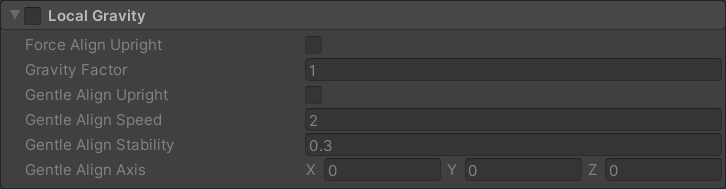

# Physics Influencer 

The Physics Influencer allows a world object or prop to be affected by a [Gravity Zone](gravity-zone.md) or [Fluid Volume](fluid-volume.md), as well as modify the center of mass of an object for those interactions, or for other uses such as vessel stability. Changes made to the active portions of the physics influencer can produce a wide variety of behaviors based on physical properties. All objects using a Physics influencer first need a [Collider](https://docs.unity3d.com/2021.3/Documentation/Manual/collider-shapes.html) of some sort, as well as a [Rigidbody](https://docs.unity3d.com/2021.3/Documentation/Manual/class-Rigidbody.html), the latter of which will be added automatically if it doesn't already exist on the object.

## UI

All three sections can be activated or deactivated by checking or unchecking the tickbox on their respective section header.
### Change Center of Mass

Change Center of Mass straightforwardly allows you to modify the center of mass with a new transform. This can be any game object that's a child of the affected GameObject.

__Center Of Mass__- 

Any child transform of the affected object. This allows you to reposition the center of mass of the entire game object, modifying it's sitting stability, center of inertia, and center of buoyancy as a byproduct.

__Update Continuously__: 

blah blah blah
### Buoyancy

Affects the physical properties and behavior in fluid of the affected GameObject. Density is an editor-only value and is only used to give you an expected density in g/m³. Volume is calculated as a function of the sum of all colliders on an object and its children in m³.

__Recalculate Density and Volume__-

__Air Drag__- coefficient of drag of unsubmerged portion while travelling straight

__Air Angular Drag__- coefficient of drag of unsubmerged portion while turning

__Fluid Drag__- coefficient of drag of submerged portion while travelling straight

__Fluid Angular Drag__- coefficient of drag of submerged portion while turning

### Local Gravity

__Force Align Upright__- forces the player into upright relative to the direction of gravity instantly.

__Gravity Factor__- TBA

__Gentle Align Upright__- Applies a force to the player to turn them upright relative to the direction of gravity.

__Gentle Align Speed__- Speed at which the player is returned to the aligned orientation.

__Gentle Align Stability__- TBA

__Gentle Align Axis__- TBA
