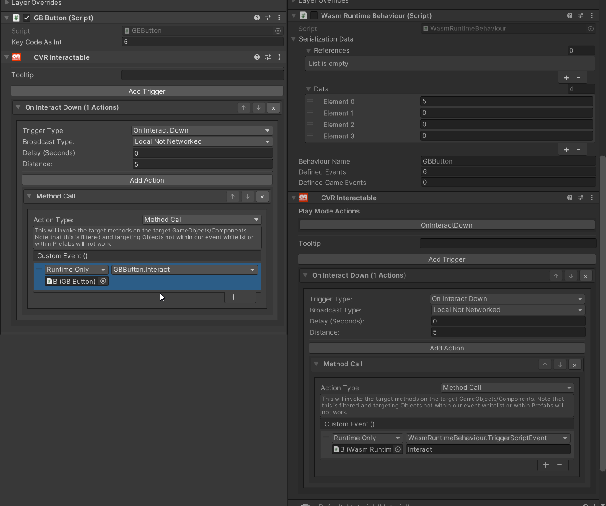

# Unity Events & Rewiring

To make a script targetable by a Unity Event you must add the `[ExternallyVisible]` attribute.
Failure to do so will result in the method not being invoked when the event is triggered in-game or in test mode!

```cs
    [ExternallyVisible]
    public void Interact()
    {
        enabled = true;
        timer = 2f;
        Emulator.Instance.joypad.handleKeyDown((GBKeyCode)keyCodeAsInt);
    }
```
<sub>Snippet from this project: `https://github.com/NotAKidoS/chilloutvr-gameboy/blob/24fa13acc322f206ae9b18c65c0551be24e5f622/Assets/test_UdonProgramSources/GBButton.cs#L23-L29` </sub>

The CCK will automatically rewire all serialized Unity Events to work in-game at build time.
This should work for all Unity Event types (dynamic & static parameter).

Before Build / After Build
