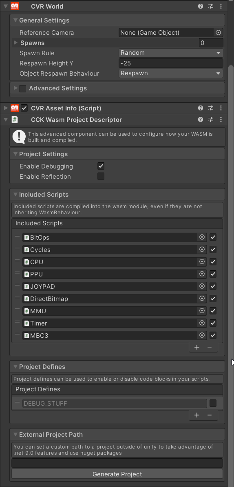

# CCK Wasm Project Descriptor

The CCK Wasm Project Descriptor is a configuration component that defines settings for building WebAssembly (WASM) scripts using our default C# scripting implementation.

Currently it allows you to:

- Enable debugging symbols and reflection for your compiled WASM module.
- Quickly define and toggle compile flags.
- Include scripts in your WASM project that don’t exist in the scene as `WasmBehaviour`.
- Define a custom `.csproj` path for advanced development (e.g. use NuGet packages, newer C# language features).
    - Allows a workflow where scripts are not fully embedded into the Unity project.
    - **Currently, this is very scuffed to work with**, as you need to create dummy WasmBehaviours in the Unity project to serialize data with.

## Using the Component

To use the CCK Wasm Project Descriptor, add it to the root GameObject of your content (Avatar, World, or Prop) in the Unity Editor (alongside the CVR Avatar, CVR World, or CVR Spawnable component).

