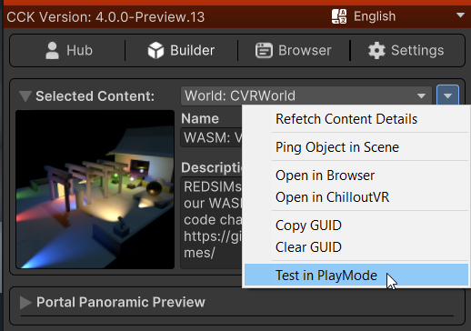
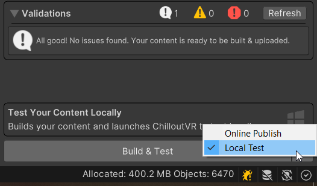

# Testing Your Content

There are a few ways to test your content during development. 
For quick iterations, Editor **Test Mode** is the fastest way to see your changes in action. 
Additionally, you can launch your content directly in ChilloutVR using **Local Testing**.

Alternatively, you can build and upload your content to ChilloutVR as normal and test it in-game.

## Test Mode

Test Mode in CCK 4.0.0+ lets you test your content directly inside the Unity Editor without a full asset bundle build and upload. This can greatly speed up iteration during development.

### Entering Test Mode

Click **Enter Test Mode** in the utility dropdown of the **Builder** tab of the Control Panel.

Unity will enter Play Mode after building a clone of your content and running any registered build processors.

While in Test Mode any scripts will run in Web Assembly (WASM) using the same runtime as ChilloutVR.

**Limitations:** Multiplayer systems and CVR APIs requiring player data or input are disabled or stubbed while in Test Mode. 

To exit, use **Exit Test Mode** in the same dropdown or stop Play Mode normally.

## Local Testing

You can launch your content directly in ChilloutVR using **Local Test** mode.
Switch the Builder to **Local Test** and click **Build & Test** to build and auto-launch CVR with your content.

**Note: Currently, Local Testing is only supported for Avatars & Worlds.** Props will be supported in a future update.

While testing a World locally, you will be placed in an offline instance of that World. You can interact with it as normal, but networking features will not be available.
When testing an Avatar locally, only you will see the Avatar, and other players will see you in your previous Avatar.
